<!-- # Eulogy for Mandy -->

## Introduction

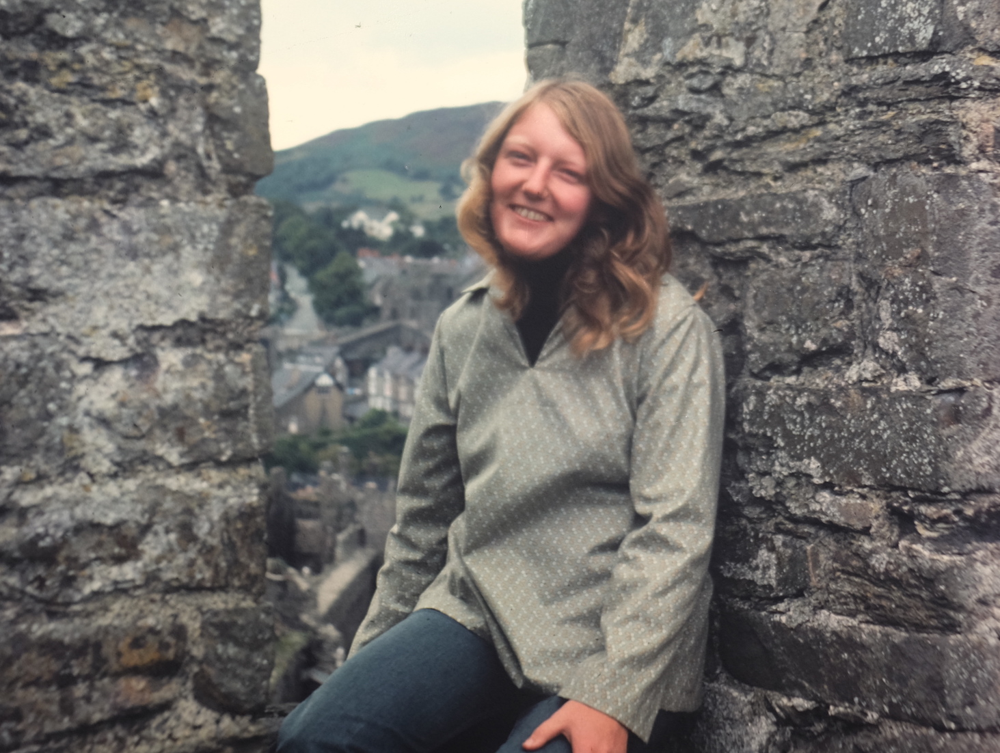

I shall tell a story, a personal view, of our relationship that extended over 40 years. I think it is through her interactions with other people that Mandy is best understood, and I hope all of you will see reflections and facets of your encounters with her in my recollection of our time together.

## Our early relationship on the Isle of Wight

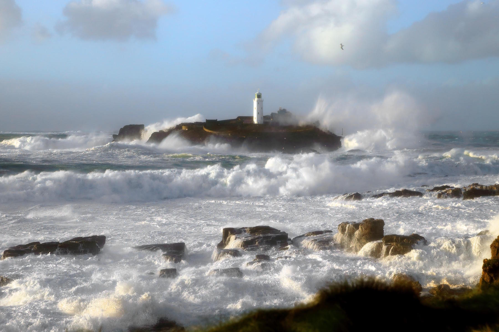

- [www.flickr.com/photos/tonyarmstrong/24861750132](https://www.flickr.com/photos/tonyarmstrong/24861750132)

As far as I can recall, Mandy and I first met while we were both in the 6th form on the Isle of Wight.  We lived 15 miles apart and went to different schools, so might as well have been at Oxford and Cambridge (Sandown and Carisbrooke schools were the Isle of Wight's "other places" of learning).  But our relationship did not begin until after I had left for University, at a new years eve party during a Christmas vacation.  Being a close rural community, news of our relationship was circulating before we even knew we had a relationship.

Mandy loved the sea and open spaces of the Isle of Wight... her love of living water and countryside stayed with her throughout her life.  She often mentioned to me the times that she just sat on the seafront in silent contemplation with her dog, Sham, watching the waves.

## University years

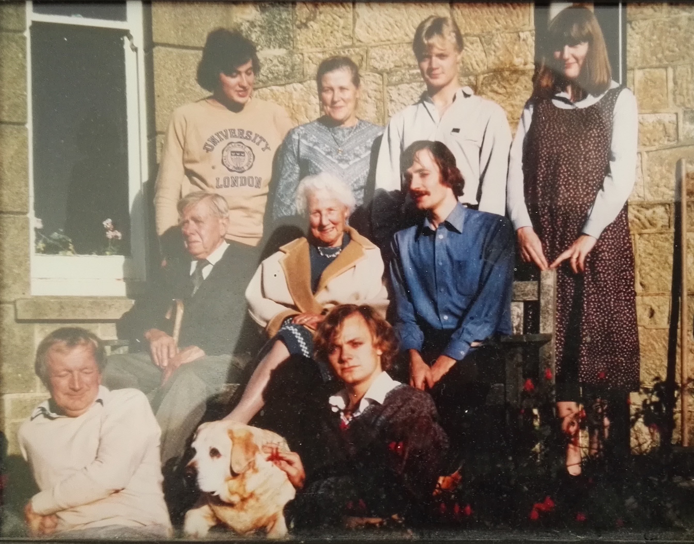

Soon after, Mandy too left for University, where she studied Human Biology, which was roughly a study of the biological science that underpins medical practice.  This would serve her well in her later career.  During this period, we continued our relationship over some distance, with regular traveling between Loughborough and Bath where she and I respectively studied.

On completing her degree, in a pattern of caring behaviour that would be typical throughout her life, she delayed starting her first employment and returned home to help care for her mother, who was at the time suffering from depression.

## Marriage, early career and starting a family

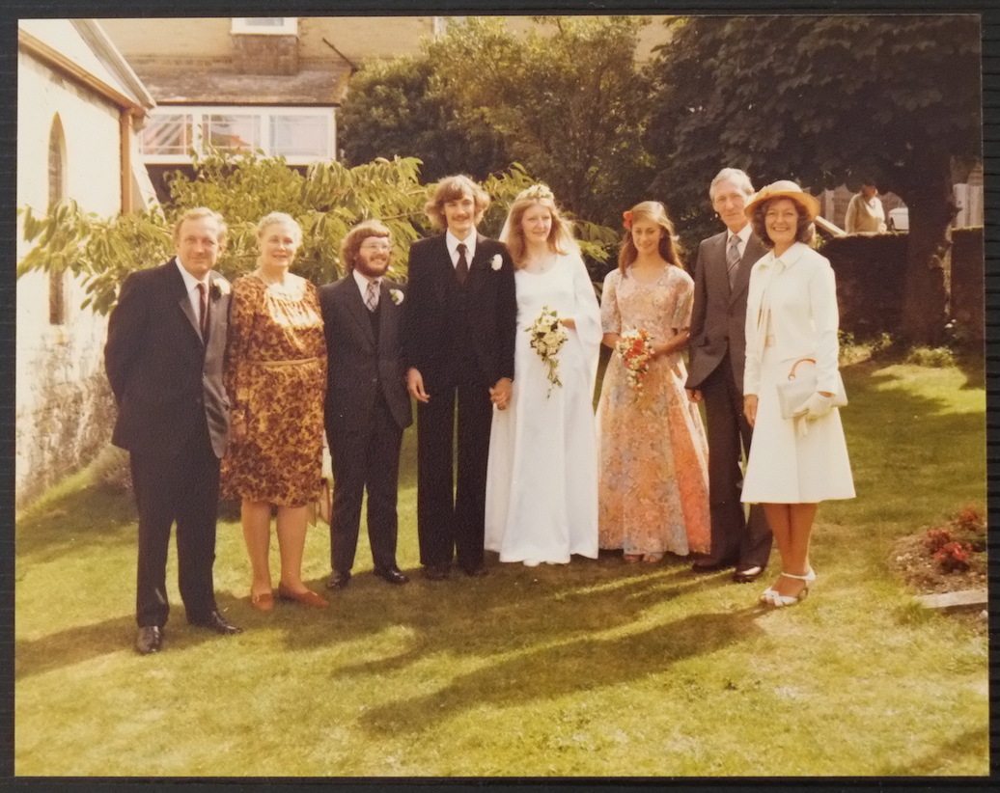

Mandy's early career was with a medical electronics company in Woking, providing general technical and documentation support for the medical diagnostic systems they made.  I had taken a job in Epsom, and bought a flat there; the job was short-lived and I took a contract in Newcastle, commuting weekly from Epsom. During this period, we somehow managed to find time to become engaged. We were married in St Peter's Church in her family's home village of Seaview on the Isle of Wight, and she set about making the flat in Epsom into our first family home.

It was Mandy who spotted, and encouraged me to apply for, the job with Oxford Instruments that caused us to move to the Oxford area in 1980, without having any idea of what work she might find.  In a change of direction that established her main career, she found work with a local medical publishing company as a trainee sub-editor.  Over the years, she honed her skills and became managing editor of a respected medical journal.

With the arrival of our first child, Ronan, she switched to freelance sub-editing, which she could do from home and combine with the duties and responsibilities of raising children.  How she managed to stay on top of both demanding activities I shall never completely understand.  About the same time, the company I worked for was bought out by its management, and I became part of a small team running what was effectively a new startup.  Mandy was terrified by this prospect, with all its attendant uncertainty, but she supported me fully through the long hours of work, as well as nurturing a new baby and continuing her own freelance work.

As if doing all this once was not enough, a couple of years later, about the time Rhiannon was born, I made another change of career to catch the rising tide of personal computing.  I resigned my secure job, spent a significant proportion of our reserves on a new personal computer and proceeded to teach myself how to program it, with no guarantee of employment.  Mandy was once again faced with defending the home front, which she did with total support and commitment - it is only in later years that I fully appreciated how big a leap of faith this was for her.

Fortunately, things came good and and over the next few years Mandy continued to nurture and guide our children through their formative years as my career took less-dramatic twists and turns.  She also provided the driving impetus for our combined efforts to build up our home environment, with two separate house extensions to provide for the needs of two growing children and two parents working from home.

## Mother's death; looking after father

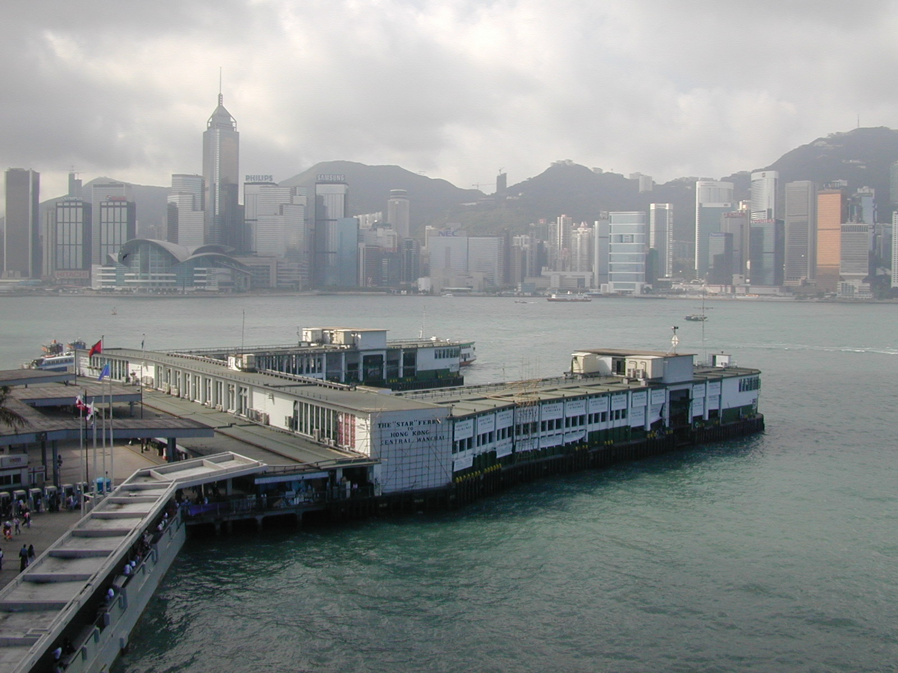

The present occasion is not the first time premature death has thwarted Mandy's aspirations.  In 1996, we were just about to travel with our children to visit Mandy's brother in Hong Kong when her mother died quite suddenly.  In the immediate aftermath, Mandy took on the task of looking after her father, who had previously suffered a stroke that left him with severely impaired speech and mobility, as well as some personality changes.  She brought him to live in our home, and for a few years managed to care for his needs, along with our children, and continuing her work (albeit at a reduced level).

The personality changes caused by her father's stroke meant that, occasionally, he would threaten violence to our young children, which forced Mandy to make the agonizing choice between looking after her children, or her father.  I don't think the eventual outcome of that choice was in doubt, but even after moving her father to a nursing home, she managed to maintain an onerous schedule of visits to him around all her other caring commitments.

## Lymphoma diagnosis, grasping opportunities

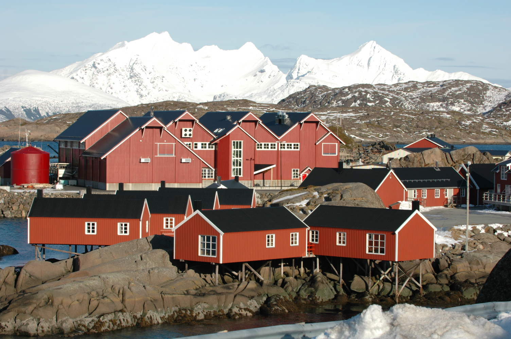

By 1999, things were looking up.  Mandy had managed to resuscitate the residue of her career as a freelance medical editor.  We have memories of Mandy getting up to work at 3AM in the morning, which was apparently when she did her best work.  One of her specialties was making her colleagues and clients look good.  She was particularly proud of the work she did with eminent doctors who were not native speakers of English, combining their expertise with her ability to fillet out the essential content of their writing, to present their ideas and experience clearly and coherently for a wider audience.

In 1999, my mother came to look after our children for a week or so, and Mandy and I traveled together to Scandinavia.  I was attending a work meeting in Oslo, and we arranged to travel by car and boat to Goteborg, then along the Swedish and Norwegian coast to Oslo. Later we spent a few days driving through the Norwegian mountains and Fjordlands, where we both fell in love with the rugged Norwegian landscape.  We would later return twice, travelling further North, beyond the Arctic circle, on Norway's coastal steamer service.

But it was later this same year that Mandy was handed her initial diagnosis of Lymphoma, which threatened to tear away all the things she'd worked so hard to achieve at a time when she might expect to enjoy some fruits of her efforts.  Mandy's confrontation with Lymphoma was not so much the "long battle" that one so often hears about, but more like a series of skirmishes separated by extended periods of peace.  During this period, she underwent two rounds of chemotherapy, and then a bone marrow transplant in 2011.

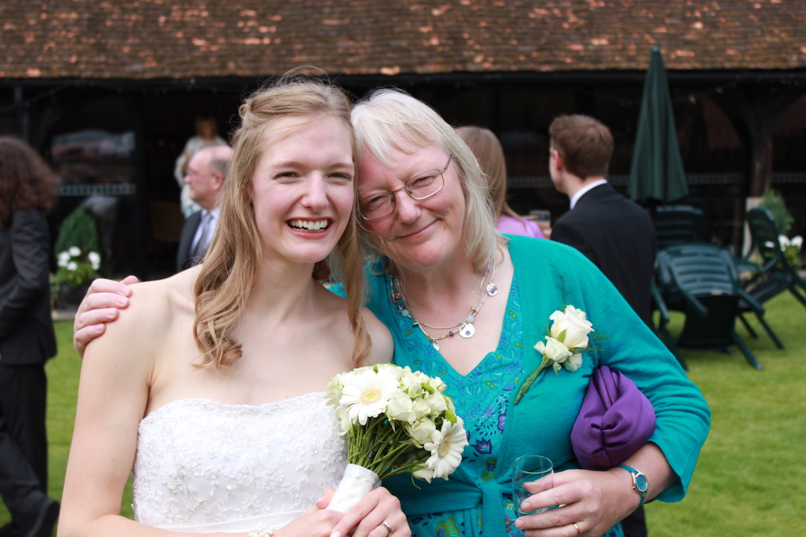
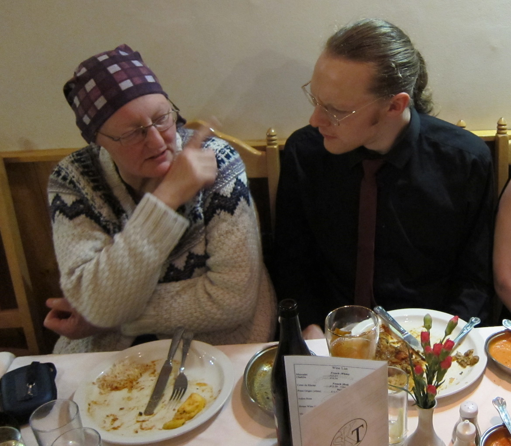

Thanks to the magnificent efforts of the medical team guided by Dr Chris Hatton (for whom Mandy would later edit a book on Haematology), the time between her bouts of gruelling treatment were richly varied and fulfilling. During this period, she was able to achieve many things that, on the original diagnosis, we had thought would be not possible for her:

- She saw both her children grow up, become independent, and marry
- She saw her first grandchild born, and spent some quality time with her
- She achieved a lifelong dream of seeing the Northern Lights
- We bought our own narrowboat and started exploring the English canal network (she particularly enjoyed the little-known Caldon Canal from Stoke to the Churnett Valley in Staffordshire)

And through all this, she did not give up one iota of her commitment to caring and looking out for others, in particular committing great amounts of her time to look after an ex-colleague, her own elderly relatives and my mother.

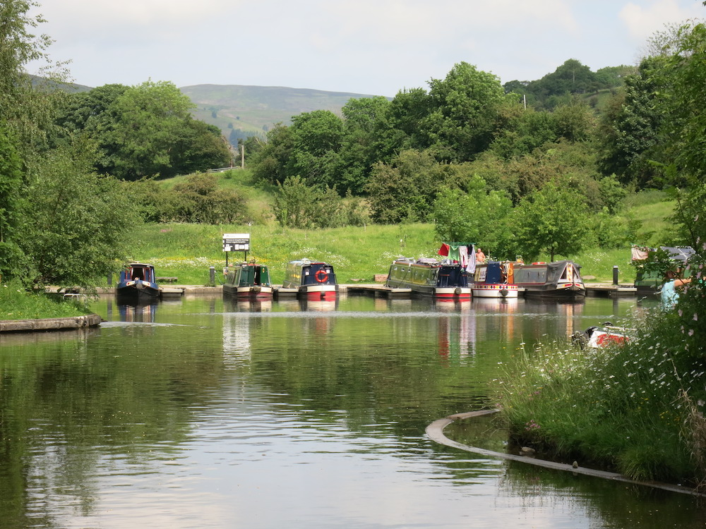

Just 2 years ago, we were able to spend 3 months traveling the canals in our narrowboat.  I think this was one of the few idyllic times in Mandy's life, and it was something we had planned to repeat in future years.

We were fortunate to have the extra time that was not foreseen, particularly our children.  She guided them through their troublesome teenage years in the face of disagreements about who knew best, helping them to blend their unique personal natures with her common sense and experience about how the world works.

## Granddaughter!

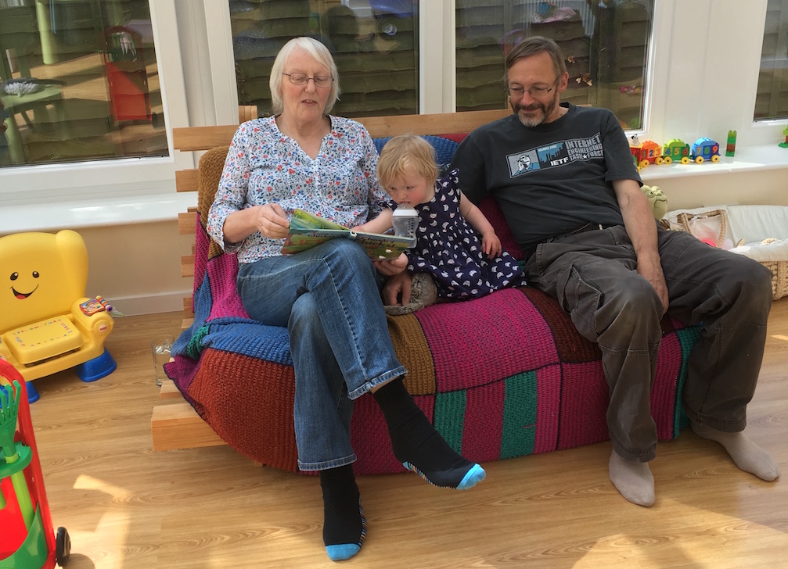
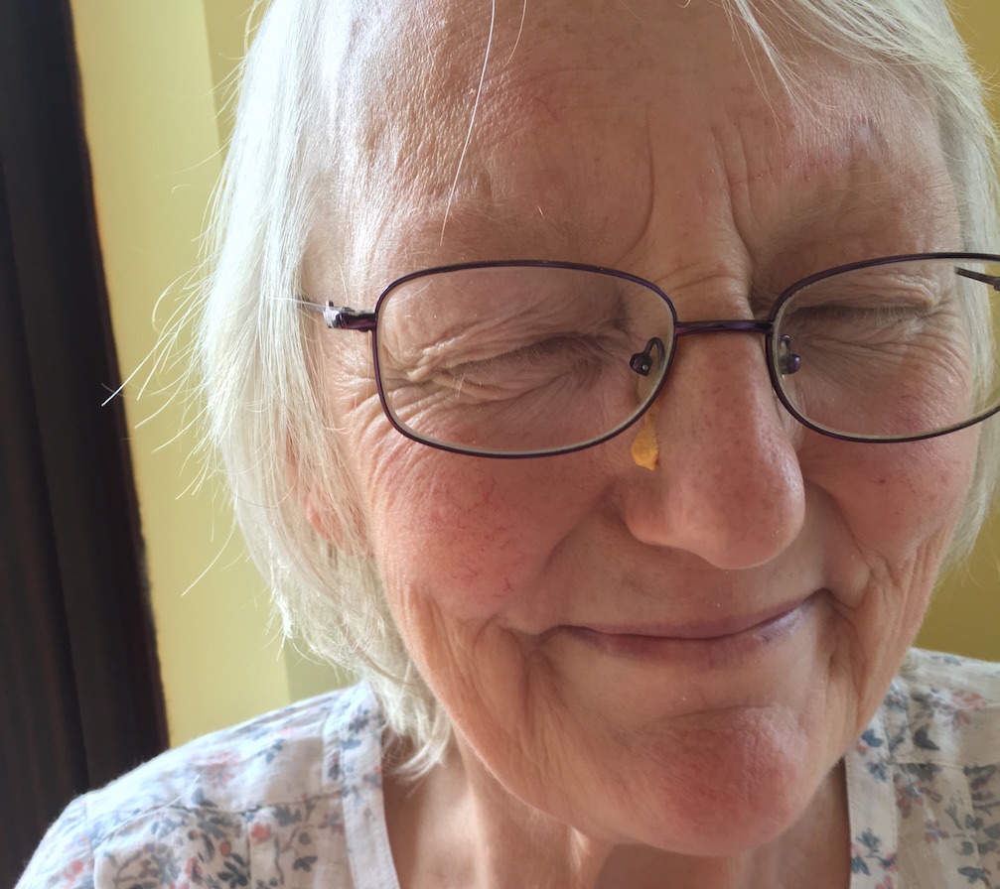

Mandy took her responsibilities as a grandmother very seriously, ensuring her granddaughter Lily was spoilt with attention in a way that parents can never do.

We believe these are the last pictures taken of Mandy. She was indulging Lily by letting her eat lunch whilst sat on her lap, resulting in red pepper humous on her face.  When we noticed, we could not stop laughing long enough to tell her what was so funny - so Rhiannon took this picture. 

Her death brings an overwhelming sadness, not just because we shall miss her, but also because Lily will not remember her consciously and will miss out on having the most incredible grandmother.  With words of comfort, a friend of Rhiannon’s said that Mandy would have had a deep and lasting impact on Lily's early development

<!-- a friend of Rhiannon's said "bits of Lily's frontal lobe have been shaped by her, and that can't be undone". -->

## The final weeks and hours

(image: cakes!)

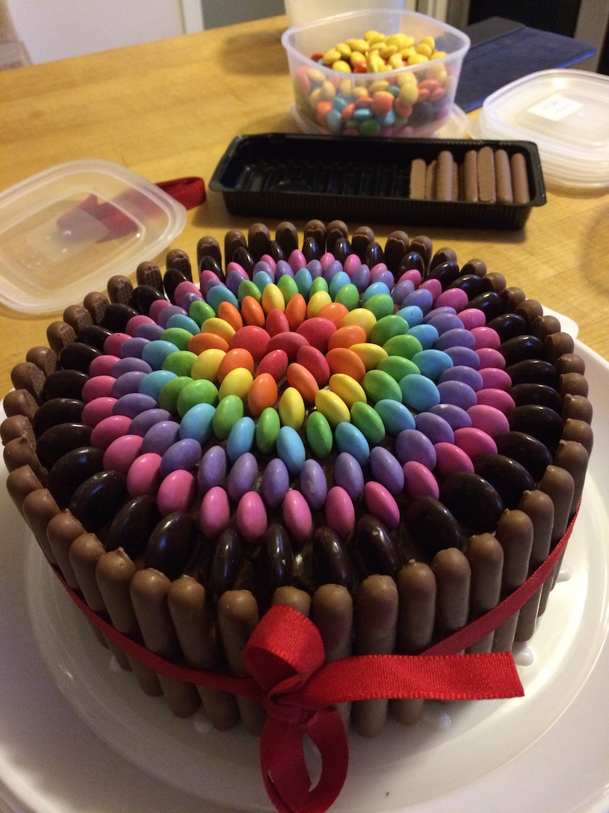
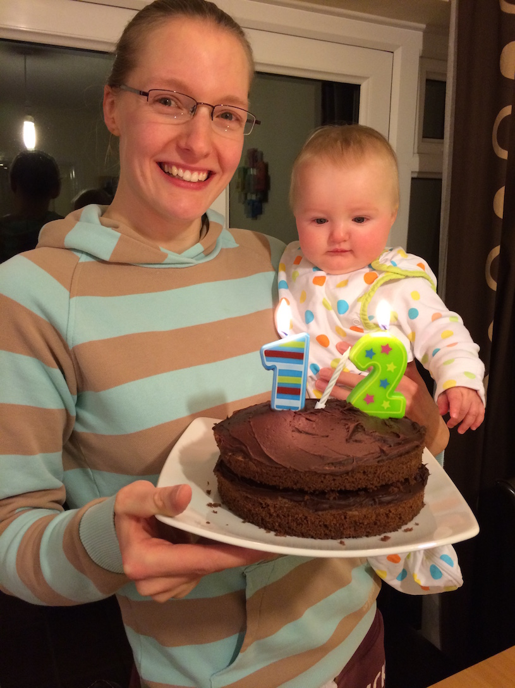
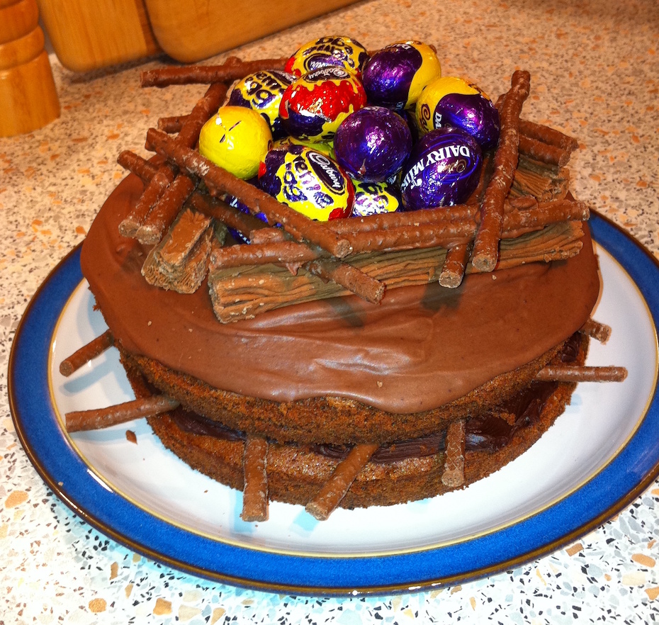

The suddenness of Mandy's death has been particularly shocking for many of us who saw her recently so full of life and hope, and recalling the last few weeks may help to understand and accept what has happened.  I shall provide a little background, then set out the story of the last few weeks and hours as I saw it.

As well as narrowboating, Mandy had a love of food and cooking. I think it was as much for its role in bringing people together as for the food itself (though her food was almost always wonderful).  What I have learned from her about good food and cooking is one of the many parts of her that will always stay with me.

Mandy had for years dreamed of upgrading our 30-year old kitchen, and over the last year, we had together planned its refurbishment.  Mandy loved to cook for her extended family, and a family meal was often a cause for a traditional style roast dinner.  An outstanding feature of Mandy's roast dinners was her exquisite roast potatoes - crisp on the outside, fluffy on the inside - which the rest of us would devour in prodigious quantities.  So a key feature of her new kitchen was to be two separate ovens, so that she could deliver sufficient quantities of roast potatoes along with the rest of the meal.  She was greatly looking forward to delivering a family Christmas dinner using hew upgraded facilities.

In June of this year we decamped to our narrowboat and builders moved in to gut and refit our kitchen, a process that was scheduled to take 6 weeks.  About two weeks in, Mandy started to feel unwell and weak, and arranged to see her GP, who promptly referred her to hospital in Oxford, ending up in the haematology facility in the Churchill.  Many samples were taken, and many tests were performed.  Eventually her condition was stabilized but no root cause for the episode was established.  She was permitted to return home, with the new kitchen in its final phase of being fitted out.  We lived for a week on take-aways and eating out.  We were starting the long process of reuniting the kitchen with the diaspora of its contents when Mandy suffered a series of fevers that eventually led to her being readmitted to hospital.

We were fully expecting this to be another short stay to stabilize her condition, and then to be sent home again.  But overnight her condition worsened and she was moved to intensive care.  The same day, results from earlier tests came through, which confirmed a diagnosis of Myelodisplasia, a failure of her bone marrow that meant it was creating dysfunctional blood cells.  Further, this was a particularly aggressive form, for which no treatment or amelioration was available.  Effectively, as I understand it, her immune system had been completely hollowed out and she had no remaining capacity to fight off infection, and she could continue to survive only with intensive medical intervention.  With no prospect of recovery, the intensive support was replaced by palliative treatments, and shortly after she succumbed peacefuly, surrounded by her family.

In keeping with how she lived her life, she died with concern not for herself, but for those she was leaving behind.  My one regret is that I did not realise then how little time we would have to communicate. I'm sure there are many things she would have insisted on telling me about how I might be able to survive without her -- such would have been her final act of caring.

## Reflections

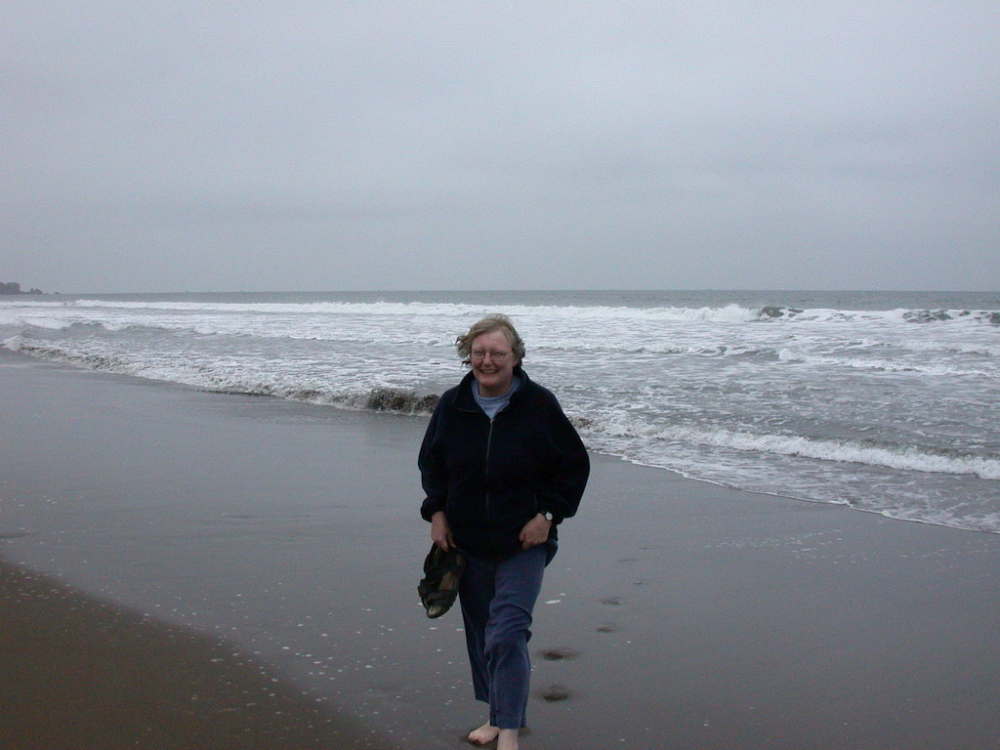

As I reflect on our 40 years or so of relationship and life together, it occurs to me that the term "homemaker", which is often used in a dismissive sense, would be a particularly apposite description of Mandy.  Even our narrowboat was imbued with homeliness through her efforts.

She wasn't always easy to live with: she could be opinionated, argumentative, sometimes dogmatic but always thoughtful and caring, expecting others to feel as she did. And her caring was unconditional, irrespective of whether she thought that the person in need was deserving of her efforts.

Typical of what she most enjoyed was an _al fresco_ summer evening meal we had in Llangollen, beside the river Dee, during our 3-month canal trip, combining good food, beautiful countryside, flowing water and the company of family.

I also reflect that Wolfson College is a particularly fitting location for this memorial: a seat of learning with a strong tradition of fairness and humanity, yet unafraid to face down difficult questions, which I think are attributes that were reflected by Mandy in her life.

I shall miss Mandy deeply, but she engendered such a broad caring community around her that it's difficult to remain down, and many of the things she built survive her: her family, the home she created, and the community she supported.

So I also look forward to carrying forward a life enriched by memories of our time together, the things we made together, and the numerous lessons she taught me.  If you catch me shedding a tear in a quiet moment, don't feel sorry for me; rather, feel happy for how much we shared together.

## Finishing up

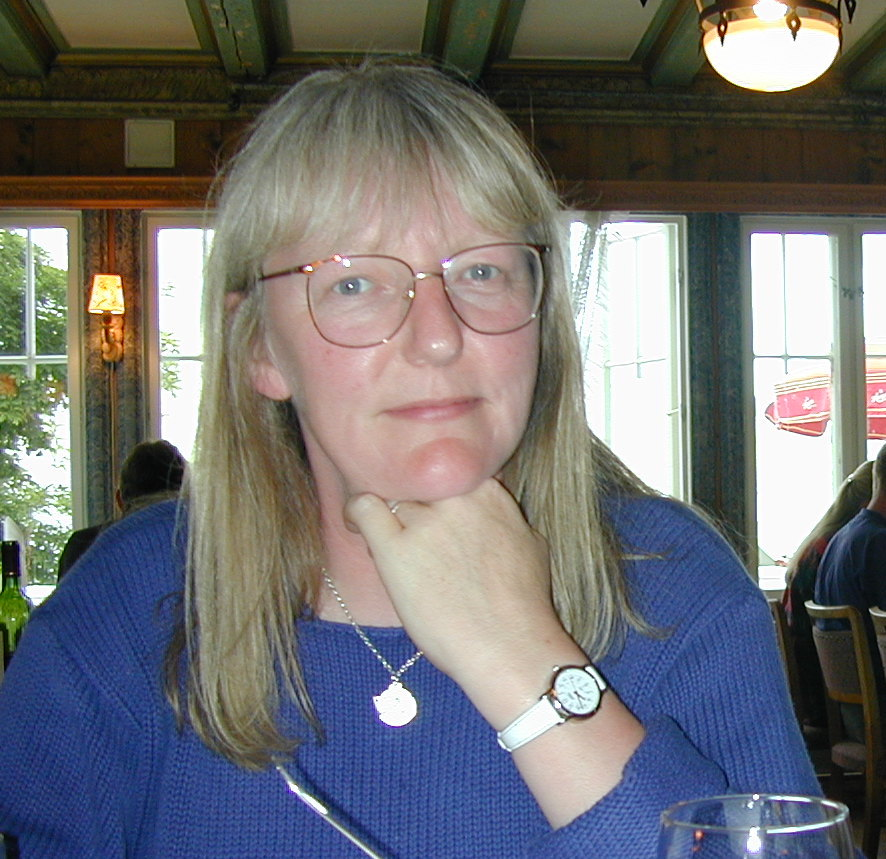

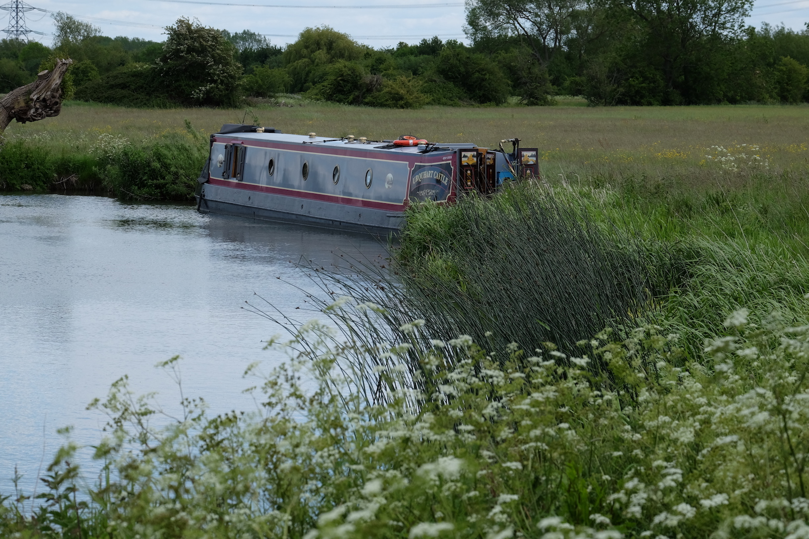

I'll finish up with a song by Show of Hands, a contemporary West Country folk duo, whom we both loved and saw live many times.  Much of their original music is rooted in the coastal and rural communities of Devon and Cornwall, not unlike the Isle of Wight where Mandy and I grew up. They combine exquisite musicianship with an acerbic political wit and keen observations of the human condition.
