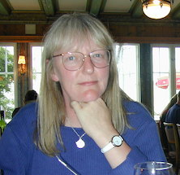

A Service of Thanksgiving for the life of  
 
Amanda (Mandy) Klyne  
 
1955 - 2016  
 
Held in Wolfson College, Oxford on 12 Aug 2016 at 16:00.  
 

<!-- @@choose different image@@ ^^^ -->

## _(Music as people arrive. Harpist: Jennifer (Jenny) Hill)_

## WORDS TO PONDER

Say not in grief that she is no more, but in thankfulness that she was.  

_(Jewish advice in death)_

## WORDS OF WELCOME

We have come together to remember Amanda, known and loved by all as Mandy  
As wife, mother, sister, colleague, friend.

Here we will mourn her leaving us,  
honour her life and death,  
and comfort each other.

We have come believing that all human life is valuable,  
that the truth and integrity and hopefulness  
which resides in each life, lives on.

We come, believing that Mandy’s life,  
which we celebrate today   
and for which we now experience great loss,  
is joined in the eternal continuum of human endeavour  
stretching into the past and into the future.

Mandy’s life was lived in its uniqueness with us  
and has now passed into the ultimate community of human existence.

The gifts and graces which she offered are never lost to us.

The creativity which he/she brought to us in her life and relationships  
lies now within our own lives and travels into the future with us.

Our lives are more beautiful because we lived with her.

## _(Music: Debussy - First Arabesque)_

## REMEMBERING WITH FLOWERS

_(Marie casts first flower)_

The first flower represents our grief.  
The pain of losing you Mandy is still intense.  
It reminds us of the depth of our love for you.

_(William casts second flower)_

The second flower represents our courage.  
To confront our sorrow,  
To comfort each other,  
To change our lives.

_(Rhiannon casts third flower)_

The third flower we cast in your memory, Mandy,  
For the times we laughed,  
The times we cried,  
The times we were angry with each other,  
The silly things you did,  
The caring and joy you gave us.

_(Ronan casts fourth flower)_

The fourth flower we cast for our love.  
We cherish the special place in our hearts that will always be reserved for you.  
We thank you for the gift your living brought to each of us.

_(Author unknown)_

## _(Music: Red is the Rose)_  <!-- Celtic flavour -->

<!-- Flower duet? -->

## PERSONAL TRIBUTES FROM FAMILY AND FRIENDS

### _(Graham, speaking for family)_

### _(Music: Show of Hands, "Thanks")_

### _(Margaret Stern, speaking for colleagues)_

_(@@Contact Margaret; say something about the work that Mandy did?@@)_

## READING 

_(Rhiannon)_

You can shed tears that she is gone,  
Or you can smile because she has lived.

You can close your eyes  
And pray that she’ll come back,  
Or you can open your eyes,  
And see all she’s left.

Your heart can be empty,  
Because you can’t see here,  
Or you can be full of the love you shared.

You can turn your back on tomorrow  
and live yesterday,  
Or you can be happy for tomorrow  
because of yesterday.

You can remember her and only that she’s gone,  
Or you can cherish her memory and let it live on.

You can cry and close your mind,  
Be empty and turn your back,  
Or you can do what she’d want:  
Smile, open your eyes, love and go on.

_(Author unknown)_

<!-- ## _(Music: Show of Hands, "Drake"?)_ -->

## _(Music: Bridge Over Troubled Water)_

## BIBLE READING - 1 Corinthians 13.1-13

_(Becky)_

If I speak in the tongues of mortals and of angels, but do not have love, I am a noisy gong or a clanging cymbal. And if I have prophetic powers, and understand all mysteries and all knowledge, and if I have all faith, so as to remove mountains, but do not have love, I am nothing. If I give away all my possessions, and if I hand over my body so that I may boast, but do not have love, I gain nothing.

Love is patient; love is kind; love is not envious or boastful or arrogant or rude. It does not insist on its own way; it is not irritable or resentful; it does not rejoice in wrongdoing, but rejoices in the truth. It bears all things, believes all things, hopes all things, endures all things.

Love never ends.

## ADDRESS

_(Becky - also representing village and friends)_

## _(Music: Fields of Gold)_

## READING - Desiderata

_(This poem has a long association with Mandy, going back to her school days.  I recall she had it on her wall or bookshelves through much her time as a student.)_

_(Ian Klyne)_

Go placidly amid the noise and the haste, and remember what peace there may be in silence. As far as possible, without surrender, be on good terms with all persons.  
Speak your truth quietly and clearly; and listen to others, even to the dull and the ignorant; they too have their story.  
Avoid loud and aggressive persons; they are vexatious to the spirit. If you compare yourself with others, you may become vain or bitter, for always there will be greater and lesser persons than yourself.  
Enjoy your achievements as well as your plans. Keep interested in your own career, however humble; it is a real possession in the changing fortunes of time.  
Exercise caution in your business affairs, for the world is full of trickery. But let this not blind you to what virtue there is; many persons strive for high ideals, and everywhere life is full of heroism.  
Be yourself. Especially, do not feign affection. Neither be cynical about love; for in the face of all aridity and disenchantment it is as perennial as the grass.  
Take kindly the counsel of the years, gracefully surrendering the things of youth.  
Nurture strength of spirit to shield you in sudden misfortune. But do not distress yourself with dark imaginings. Many fears are born of fatigue and loneliness.  
Beyond a wholesome discipline, be gentle with yourself. You are a child of the universe no less than the trees and the stars; you have a right to be here.  
And whether or not it is clear to you, no doubt the universe is unfolding as it should. Therefore be at peace with God, whatever you conceive Him to be.  
And whatever your labors and aspirations, in the noisy confusion of life, keep peace in your soul. With all its sham, drudgery and broken dreams, it is still a beautiful world. Be cheerful. Strive to be happy.

_(Max Ehrmann)_

## WORDS OF FAREWELL

_(Becky)_

To love someone is to risk the pain of parting.  
Not to love is never to have lived.  
The grief which we now experience is the honouring of our love.  
Let us now in a quiet moment make our farewell to Mandy.

As we bid farewell to Mandy, let us commit ourselves to loving and supporting each other.

And now let us go into the world,  
Glad that we have loved,  
Free to weep for the one we have lost,  
Free to hold each other in our human frailty,  
Determined to live life to the full  
As did Mandy.  

## After the service

We now listen to Jenny play the "Spring" theme from Vvaldi's "Four Seasons", one of Mandy's favourite pieces of music.  We shall then gather in the Haldane Room for refreshments and to sign the book of remembrance.

There will also be an opportunity for you to remember Mandy in a time of personal reflection as you cast petals from Wolfon's Rainbow Bridge into the Cherwell.

## _(Music: Spring theme from Vivaldi's Four Seasons)_

<!--

## On back of order of service

_(a key reading (Desiderata?))_

Donations in memory of Mandy will be presented to [Cancer Research](http://www.cancerresearchuk.org).

thanks to... @@draft

-->
